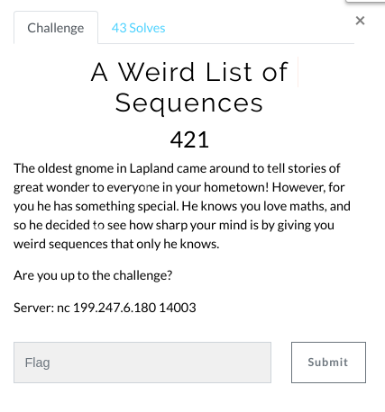

# A Weird List of Sequences (Misc)

Hi CTF player. If you have any questions about the writeup or challenge. Submit a issue and I will try to help you understand.

Also I might be wrong on some things. Enjoy :)

(P.S Check out my [CTF cheat sheet](https://github.com/flawwan/CTF-Candy))



Connecting to the netcat server we get a prompt saying we need to supply a captcha code.


Using pwntools and a simple md5 bruteforce script we quickly crack the captcha.

```python
from pwn import *
import hashlib

r = remote("199.247.6.180", 14003)
r.recvuntil("=")
captcha = r.recvuntil(".")[:-1]
i=0
while True:
	i+=1
	md5str=hashlib.md5(str(i)).hexdigest()[:5]
	if md5str == captcha:
		print "Found captcha %i" % i
		break

r.sendline(str(i))
```

After cracking the captcha, we can start the challenge.


Okay we have to predict the number sequence 25 times. Doing it by hand is quite hard. Let's use `oeis.org`.


Again manually typing all these numbers in to the website is boring. Also there might be a timeout (untested). Automating the process with python is easier and more fun. Let's do that.

### Creating a automatic tool to solve the task

Our goal is to:
* Bruteforce the captcha
* Parse the given number sequence.
* Send the number sequence to oeis.org.
* Fetch the next predicted number from the response of oeis.org.
* Send the number to the server.
* Loop 25 times.
* Get the flag

With this python script I used the following libraries:
* Pwntools - Connect to challenge server over tcp.
* requests - To send GET request to oeis.org
* pyquery - Parsing the response of oeis.org to get the next predicted number
* hashlib - md5 encode function

```python
from pwn import *
import hashlib
import requests
from pyquery import PyQuery as pq

r = remote("199.247.6.180", 14003)
r.recvuntil("=")
captcha = r.recvuntil(".")[:-1]
i=0
while True:
	i+=1
	md5str=hashlib.md5(str(i)).hexdigest()[:5]
	if md5str == captcha:
		print "Found captcha %i" % i
		break

r.sendline(str(i))

for i in range(25):
	r.readuntil("[")
	numbers_sequence = r.readuntil("]")[:-1]
	plog = log.progress("Debug")
	plog.success("Sequence %d of %d" % (i,25))

	plog = log.progress('Server')
	plog.success("Recieved sequence from server:\n%s" % numbers_sequence) 	
	response = ""
	plog = log.progress("Oesis")
	plog.status("Searching on oesis")
	try:
		rr = requests.get("https://oeis.org/search?q=%s" % numbers_sequence)
		p = pq(rr.text)
		response = rr.text
		found_sequence = pq(p("table td tr tt > b")[0]).parent().text()
		plog.status("Found sequence:\n %s" % found_sequence)
		next_number = int(found_sequence.replace(numbers_sequence,"")[2:].split(",")[0])
		plog.success("Predicting new number to be %d" % next_number)
	except Exception:
		plog.error("Failed to parse numbers from oeis")
		print response
		exit()
	print "Predicting next number is {%d}" % next_number
	r.sendline(str(next_number))
r.interactive()
```

Running the script, we get the flag after 25 solved sequences! Cool


