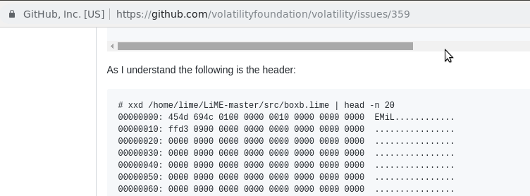
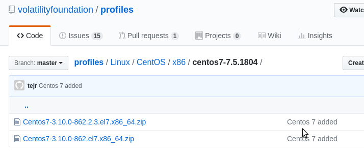

# Bucket 'o cash (175)

Hi CTF player. If you have any questions about the writeup or challenge. Submit a issue and I will try to help you understand.

Also I might be wrong on some things. Enjoy :)


We are given a memory dump of some unknown os.

Testing the obvious
```
file memorydump
memorydump: data
```
```
$ strings memorydump | grep "RITSEC"
```

To view the head of the file we can use `xxd`

```
xxd memorydump | head
00000000: 454d 694c 0100 0000 0010 0000 0000 0000  EMiL............
00000010: ffeb 0900 0000 0000 0000 0000 0000 0000  ................
00000020: 0000 0000 0000 0000 0000 0000 0000 0000  ................
00000030: 0000 0000 0000 0000 0000 0000 0000 0000  ................
00000040: 0000 0000 0000 0000 0000 0000 0000 0000  ................
00000050: 0000 0000 0000 0000 0000 0000 0000 0000  ................
00000060: 0000 0000 0000 0000 0000 0000 0000 0000  ................
00000070: 0000 0000 0000 0000 0000 0000 0000 0000  ................
00000080: 0000 0000 0000 0000 0000 0000 0000 0000  ................
00000090: 0000 0000 0000 0000 0000 0000 0000 0000  ................
```
When we google parts of the hex we end up on the volatilityfoundation github. Okay this probably means we should use Volatility to extract the flag.



To use Volatility we have to figure out which OS is running.

We can use the strings command to grep for Linux version.

```bash
$ strings memorydump | grep "Linux version"

   Linux version 3.10.0-862.el7.x86_64 (builder@kbuilder.dev.centos.org) (gcc version 4.8.5 20150623 (Red Hat 4.8.5-28
```

We see the `kbuilder.dev.centos.org` string. This means centos is probably running.

When we google the version we get the following.


Okay, it is definitely running CentOS 7.xxx

Let's google and see if we can find a premade profile that we can use in volatility.



We see that it matches the version `3.10.0-862.el7.x86_64`. Cool lets download that and place the zip folder in:
`/usr/lib/python2.7/dist-packages/volatility/plugins/overlays/linux`

We can use this command to verify that we installed it correctly:
```bash
$ volatility --info | grep "Profile"
Volatility Foundation Volatility Framework 2.6
Profiles
LinuxCentos7-3_10_0-862_2_3_el7_x86_64x64 - A Profile for Linux Centos7-3.10.0-862.2.3.el7.x86_64 x64
...
```

Lets list all the running processes.

```bash
$ volatility -f memorydump linux_psaux --profile=LinuxCentos7-3_10_0-862_2_3_el7_x86_64x64

]                                                   
13480  0      0      /sbin/agetty --noclear tty2 linux                               
13481  0      0      /sbin/agetty --noclear tty3 linux                               
13488  0      0      [kworker/0:0]                                                
13498  0      0      ./flag                                                       
13500  0      0                      
```

There's a flag process running with PID 13498. Let's dump that


```bash
$ volatility -f memorydump linux_procdump --pid 13498 --profile=LinuxCentos7-3_10_0-862_2_3_el7_x86_64x64 -D output
Offset             Name                 Pid             Address            Output File
------------------ -------------------- --------------- ------------------ -----------
0xffff8ed8402cbf40 flag                 13498           0x0000000000400000 output/flag.13498.0x400000
```
Running the file did not work. It segfaulted.
Lets run strings on it

```
$ strings output/flag.13498.0x400000
/lib64/ld-linux-x86-64.so.2
libc.so.6
puts
__libc_start_main
__gmon_start__
GLIBC_2.2.5
UklUU0VDH
e00zbTByH
D$ Cg==H
eV9GMHIzH
bnMxY3N9H
D$27
UH-0
UH-0
[]A\A]A^A_
;*3$"
/lib64/ld-linux-x86-64.so.2
libc.so.6
puts
__libc_start_main
__gmon_start__
GLIBC_2.2.5
UklUU0VDH
e00zbTByH
D$ Cg==H
eV9GMHIzH
bnMxY3N9H
D$27
UH-0
UH-0
[]A\A]A^A_
;*3$"
```

We see some strings that look like base64. Let's remove all other stuff that doesn't look like a base64 string.

```
UklUU0VDH
e00zbTByH
eV9GMHIzH
bnMxY3N9H
UklUU0VDH
e00zbTByH
eV9GMHIzH
bnMxY3N9H
```

Concatenating we get the following string:

`UklUU0VDHe00zbTByHeV9GMHIzHbnMxY3N9HUklUU0VDHe00zbTByHeV9GMHIzHbnMxY3N9H`

```bash
$ echo -n "UklUU0VDHe00zbTByHeV9GMHIzHbnMxY3N9HUklUU0VDHe00zbTByHeV9GMHIzHbnMxY3N9H" | base64 -d
RITSECí4ʹÁÈwôc#1ۜÌXÜßGRITSECí4ʹÁÈwôc#1ۜÌXÜßG
```
Hmmm not the correct one


Looking at the strings we see that each line ends with a "H". I don't know what this is but if we remove each and every "H".

```bash
UklUU0VD
e00zbTBy
eV9GMHIz
bnMxY3N9
UklUU0VD
e00zbTBy
eV9GMHIz
bnMxY3N9
```

Concatenating we get the following:

`UklUU0VDe00zbTByeV9GMHIzbnMxY3N9UklUU0VDe00zbTByeV9GMHIzbnMxY3N9`

Lets try to base64 decode it.

```bash
$ echo -n UklUU0VDe00zbTByeV9GMHIzbnMxY3N9UklUU0VDe00zbTByeV9GMHIzbnMxY3N9 | base64 -d
RITSEC{M3m0ry_F0r3ns1cs}RITSEC{M3m0ry_F0r3ns1cs}
```

We get the flag twice!
